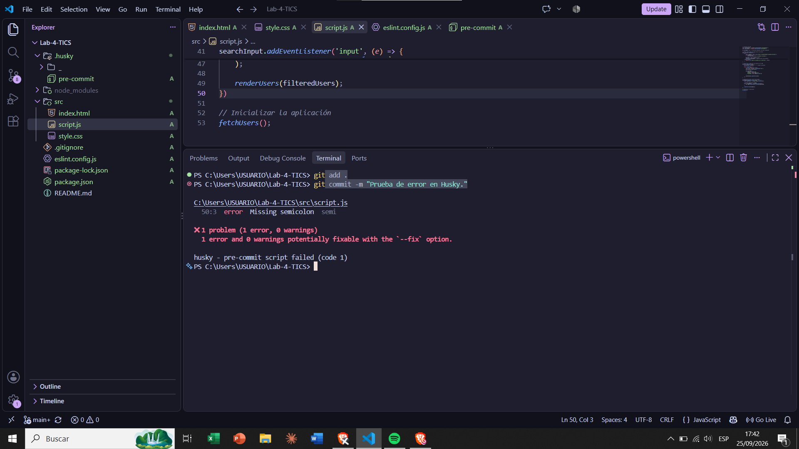
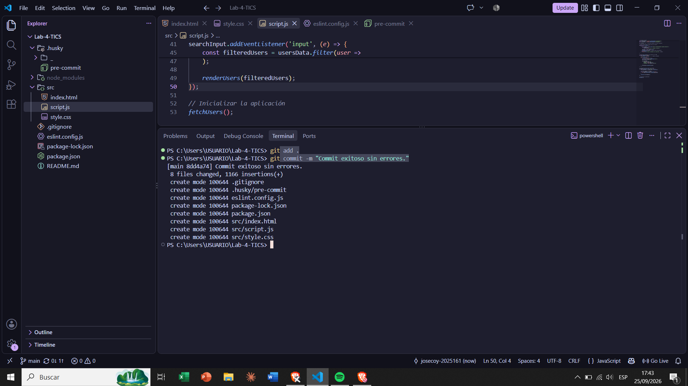
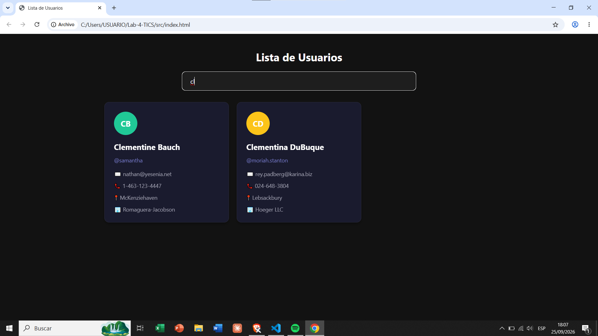
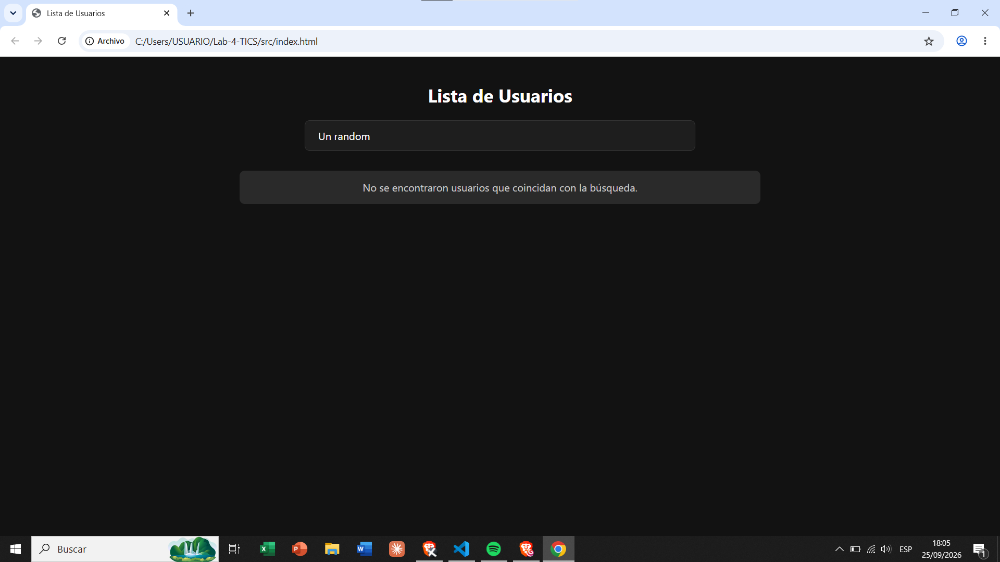
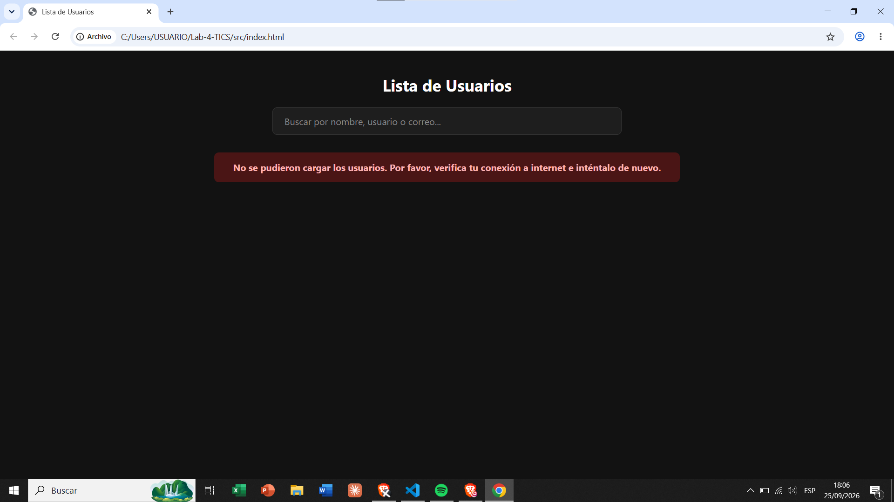

# Laboratorio 4 - TICS

App web que integra el consumo de una API pública, manipulación dinámica del DOM y cuenta con linters automatizados mediante Husky y ESLint para el control de calidad del código en los commits.

## Tecnologías Utilizadas

- HTML, CSS, JavaScript
- API: [JSONPlaceholder](https://jsonplaceholder.typicode.com/users)
- ESLint (Flat Config)
- Husky

## Estructura del Proyecto

El proyecto sigue la siguiente estructura de directorios, adaptada para la entrega final:

- `src/` — Contiene los archivos principales de la aplicación (`index.html`, `style.css`, `script.js`).
- `images/` — Almacena las capturas de pantalla de las pruebas de funcionamiento y pre-commit.
- `.husky/` — Archivos de configuración para los ganchos de Git (pre-commit).

## Instalación y Ejecución

1. Clonar el repositorio.
2. Instalar las dependencias de desarrollo (Husky y ESLint):

   ```bash
   npm install
   ```

3. Abrir el archivo `src/index.html` en el navegador de su preferencia.

## Verificación Pre-Commit (Husky + ESLint)

Este proyecto utiliza Husky para interceptar los commits. Al ejecutar un `git commit`, Husky dispara un hook de pre-commit que ejecuta `npx eslint .`. Si el código no cumple con las reglas estrictas configuradas en `eslint.config.js` (como el uso de comillas simples y punto y coma), el commit se bloquea automáticamente para evitar subir código incorrecto.

## Capturas de los commits

- **Husky bloqueando el commit por errores de estilo:**

   

- **Commit exitoso tras corregir los errores de código:**

   

## Capturas del Sistema

- **Página funcionando correctamente:**

   

- **Interacción básica de búsqueda:**

   

- **Mensaje de información al no encontrar coincidencias:**

   

- **Mensaje de error al fallar la petición (fetch):**

   